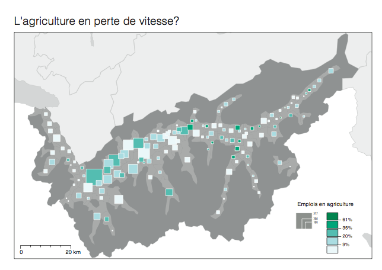

# Cartographie thématique avec ThemaVis

En vue de la cartographie thématique avec des symboles proportionnels et surtout les symboles proportionnels colorés, nous allons utiliser le logiciel ThemaVis. Le logiciel est disponible librement pour Mac OS X depuis [https://github.com/christiankaiser/themavis-osx](https://github.com/christiankaiser/themavis-osx). Le plus simple est d'utiliser le [lien direct vers le fichier de téléchargement](https://github.com/christiankaiser/themavis-osx/blob/master/releases/ThemaVis-v015.dmg?raw=true).

Le fichier [structure-themavis.pdf](https://github.com/SimonMartinCH/visage/blob/master/06_themavis/structure-themavis.pdf) explique la structure du logiciel qui sera expliquée pendant le cours et qui permet de comprendre comment il faut procéder idéalement pour créer une carte thématique.

L'exercice de la semaine est de créer une carte en symboles proportionnels colorés. Vous pouvez prendre un indicateur qui vous servira pour votre dossier pratique. Afin de permettre dans tous les cas la création d'une telle carte, nous fournissions un exemple avec des données déjà prêtes. Il s'agit d'une carte sur les emplois dans l'agriculture dans les communes valaisannes. Le fichier [carte-agriculture-valais.pdf](https://github.com/christiankaiser/visage/blob/master/semaine-06/carte-agriculture-valais.pdf) montre le résultat dont voici une version miniature:

Les données de géométries qui sont utilisées proviennent de l'Office Fédéral de la Statistique OFS, de la section ThemaKart. Il s'agit du jeu de données des géométrie des bases au niveau de généralisation K4, il est documenté [ici](http://www.bfs.admin.ch/bfs/portal/fr/index/regionen/thematische_karten/01/02.html). Ces géométries doivent être achetées auprès de l'OFS. L'UNIL possède une licence sur le serveur Unilgis. Pour avancer un peu plus rapidement, nous vous mettons à disposition les données déjà préparées (envoyées par mail).

Les données statistiques sont publiquement accessibles et ont été téléchargées depuis l'eAtlas du Valais (http://www.unil.ch/eatlasvs). Les données proviennent de l'Office fédéral de la statistique, du recensement fédéral des entreprises (données sur les emplois) et de STATPOP 2010 pour les données sur la population résidente. Le fichier [vs-cmnes-data.csv](https://github.com/SimonMartinCH/visage/blob/master/06_themavis/vs-cmnes-data.csv) contient les données déjà préparées.

En vue de l'exercice, le mieux est de joindre le fichier CSV aux fichier Shape des points des communes (k4_cmnes_2011_pts.shp), car ça permet le placement exact des symboles.

## Objectif de l'exercice

Créer une carte en symboles proportionnels dans ThemaVis et la terminer dans Illustrator.

Concrètement, l'exercice consiste en:

+ Faire une carte du nombre et la part d'emplois dans l'agriculture dans les communes valaisannes.
+ Données sont à disposition (voir liens ci-dessus)
+ Légende séquentielle, classification Jenks (dans QGIS)
+ Palette de couleurs appropriée (consultez [Colorbrewer](http://colorbrewer2.org))
+ Soyez esthétiques

Le [tutoriel ThemaVis](https://www.youtube.com/playlist?list=PLbjixabFMUzOo232IOnPQNVPjzs8Nxg66) vous guide à travers les étapes nécessaires pour créer votre carte.

