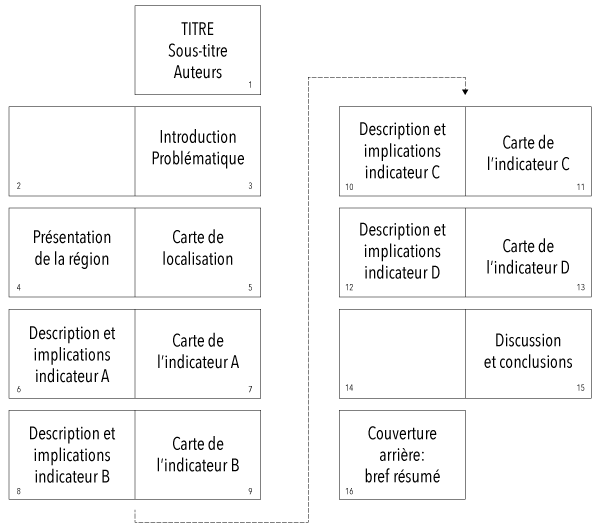

# Dossier pratique: instructions

Le dossier pratique pour le cours de «Visualisation et analyse de données géographiques» est un travail qui se fait seul ou en groupes de 2 personnes. Le dossier doit présenter la structure démographique, sociale et économique d'une région de votre choix.

Le travail comprend la description de la région, la sélection d'indicateurs pértinents, la cartographie des indicateurs, un commentaire de la structure spatiale ainsi que le calcul d'indicateurs d'analyse spatiale.

Au niveau de la **thématique**, vous pouvez en choisir librement une qui vous intéresse. Par contre, votre dossier doit s'insérer dans une logique de présentation et d'analyse d'un aspect précis de votre région. Des exemples de thématique peuvent être:  

* *Potentiel de développement économique du Chablais valaisan et vaudois.*  En raison des développements récents, une ré-orientation économique du Chablais pourrait être intéressante. Dès lors, il est important de connaître la structure économique actuelle (combien d'entreprises et emplois dans quel secteur?), d'évaluer les secteurs qui pourraient rencontrer des problèmes et d'en évaluer la quantité d'emplois liés (p.ex. secteur de la pétrochimie), etc.

* *Développement démographique et accessibilité*. L'augmentation de la population a souvent lieu dans les agglomération. Ce sont notamment les immigrants qui choisissent généralement les agglomérations pour y habiter. Par contre, les lieux moins accessibles perdent des habitants.

* *Potentiel touristique d'un parc naturel*. Étudier, à travers une analyse cartographique et statistique, si un parc naturel pourrait compléter l'offre touristique existante de manière intéressante. Quelle est l'accessibilité du parc depuis les aires urbaines? etc.

Le plus important lors du choix de la thématique, et de son analyse, est de **sortir des banalités** et d'avancer des hypothèses sans les vérifier. Par exemple, il faut éviter de dire que *«En Suisse, le secteur économique des services est en constant progrès. Ces services sont localisés en ville, d'où dépeuplement des espaces ruraux.»* Ce sont des généralités qui nécessitent un regard critique et qui doivent être vérifiées. Il serait plus intéressant de regarder dans quelles régions les services sont en progrès, et de relever les endroits qui font mieux ou moins bien que d'autres.

Au niveau de la **région**, vous êtes très libres. Vous pouvez choisir n'importe quelle région dans le monde, à condition d'avoir au minimum plusieurs dizaines d'unités spatiales et d'être en mesure de trouver des données pertinentes par vous-mêmes.

## Structure du dossier

Le dossier doit avoir la structure suivante:

1. Introduction.

2. Description de la problématique de recherche, y compris les questions et hypothèses de recherche. Partez d'un problème d'actualité, ou d'un scénario réaliste. Décrivez le problème et les implications potentielles, ainsi que les évolutions futures possibles. Appuyez-vous sur des documents fiables, des articles de journaux etc.

3. Sélectionnez des indicateurs pertinents pour analyser et discuter plus en profondeur votre problématique. Description et justification des indicateurs choisis. Au moins 4 différents indicateurs doivent être choisis.

4. Localisation de la région, description générale, avec carte de situation et de localisation. Décrivez les spécificités de la région, les questions d'accessibilité, structure économique, etc. Appuyez-vous sur des documents fiables, une analyse du contexte géographique général, et non sur un lecture simple de Wikipédia…

5. Cartographie des indicateurs, commentaire de la structure spatiale pour chaque indicateur, y compris l'apport de cette information pour confirmer ou rejeter les hypothèses de recherche. Si nécessaire, la carte et le texte doivent être complétés par des graphiques ou illustrations.

6. Discussion contenant un bref résumé de vos résultats, avec une description de l'apport de vos indicateurs cartographiés. Réponse aux questions de recherche formulées au début du dossier; cette réponse doit s'appuyer sur les informations extraites des cartes respectivement d'informations d'indicateurs d'analyse spatiale ou statistiques.

7. Liste des références cités dans le texte.

Au niveau technique, vous allez utiliser **Adobe Illustrator** pour l'ensemble de votre dossier, sauf pour le correcteur d'orthographe. Le format de page (portrait ou paysage) doit se faire en fonction de l'étendu de votre région; pour une région plus large que haute, le format de votre dossier sera A4 paysage. Le dossier fera en principe 16 pages, et la mise en page et structuration de votre dossier **doit** se faire de la manière suivante:

* Page 1: Titre court et clair, avec un sous-titre pouvant préciser la thématique plus en détail. Les noms des auteurs doivent bien évidemment aussi y figurer. N'utilisez pas le template de la page de titre de l'UNIL, mais faites votre propre page de titre.
* Page 2: en principe vide.
* Page 3: introduction à votre thématique, présentation de la problématique etc.
* Page 4: Présentation textuelle de votre région, en faisant référence à la carte de la page 5.
* Page 5: Carte de localisation de votre région
* Pages 6-13: Cartes des indicateurs (à droite, pages impaires) avec description de l'indicateur, de la structure spatiale et des implications par rapport à votre thématique choisie (à gauche, pages paires). Des graphiques peuvent également y être insérés.
* Page 14: en principe vide
* Page 15: Discussion et conclusions par rapport à votre analyse et votre thématique.
* Page 16: Couverture arrière de votre dossier avec un bref résumé du contenu de votre dossier

Graphiquement, la structure de votre dossier se présente comme suit:

Bien évidemment, certaines descriptions ne prendront pas l'ensemble de la page A4. Dans ce cas, le but n'est pas de remplir la page, mais de mettre en page le contenu disponible d'une manière logique favorisant la communication et l'esthétique du document.

Afin de faciliter le début du dossier, un fichier Illustrator préparé avec les différentes pages vous est fourni ([Modèle paysage](https://github.com/SimonMartinCH/visage/blob/master/dossier-pratique/structure/template-a4paysage.ai),[Modèle portrait](https://github.com/SimonMartinCH/visage/blob/master/dossier-pratique/structure/template-a4portrait.ai)). Dans le travail concret, favorisez le processus suivant:

* Écrivez vos textes avec un traitement de texte comme p.ex. Word, avec un correcteur d'orthographe et de grammaire moderne
* Faites vos cartes dans un document Illustrator à part
* Une fois que le contenu est prêt, insérez le tout dans le *«document maître»* contenant l'ensemble des pages de votre dossier.

Veillez à une cohérence globale de votre graphique au niveau du contenu, de la communication et du graphisme. Il est conseillé de travailler avec des lignes auxiliaires p.ex. pour définir 7 «colonnes virtuelles» qui peuvent être utilisées de manière flexible pour disposer les éléments sur la page.
